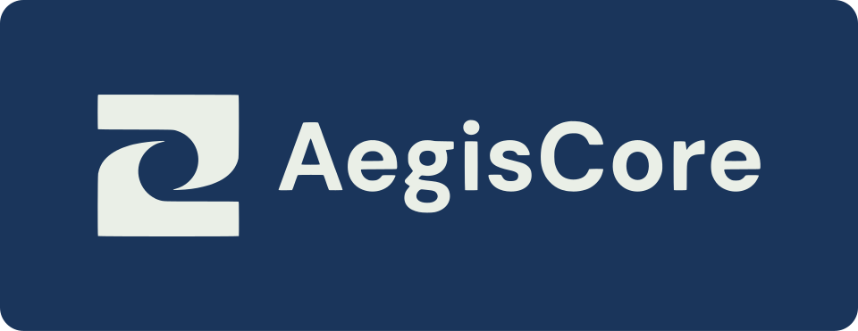
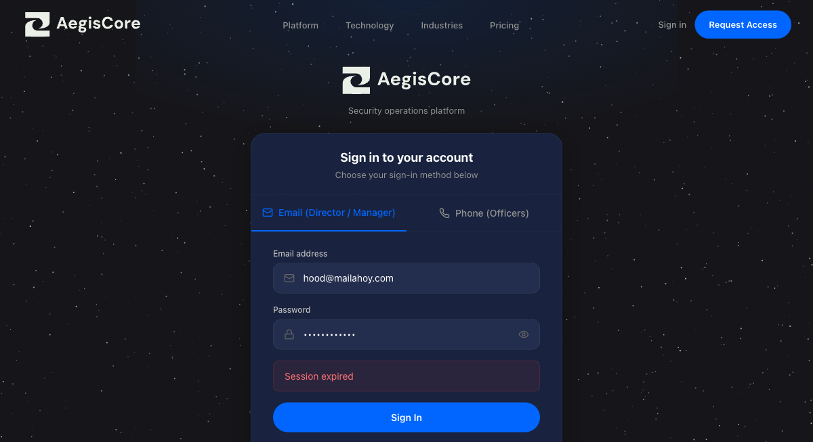
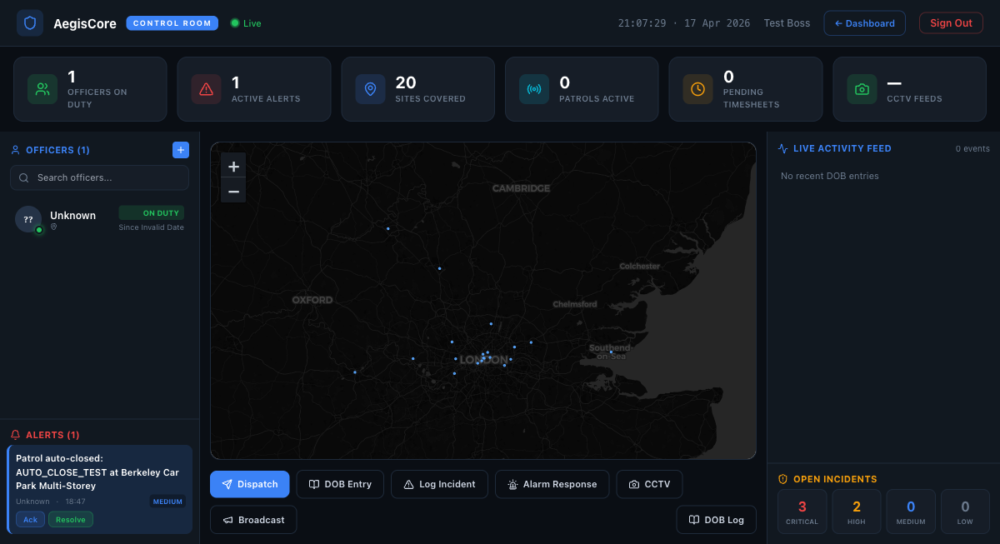
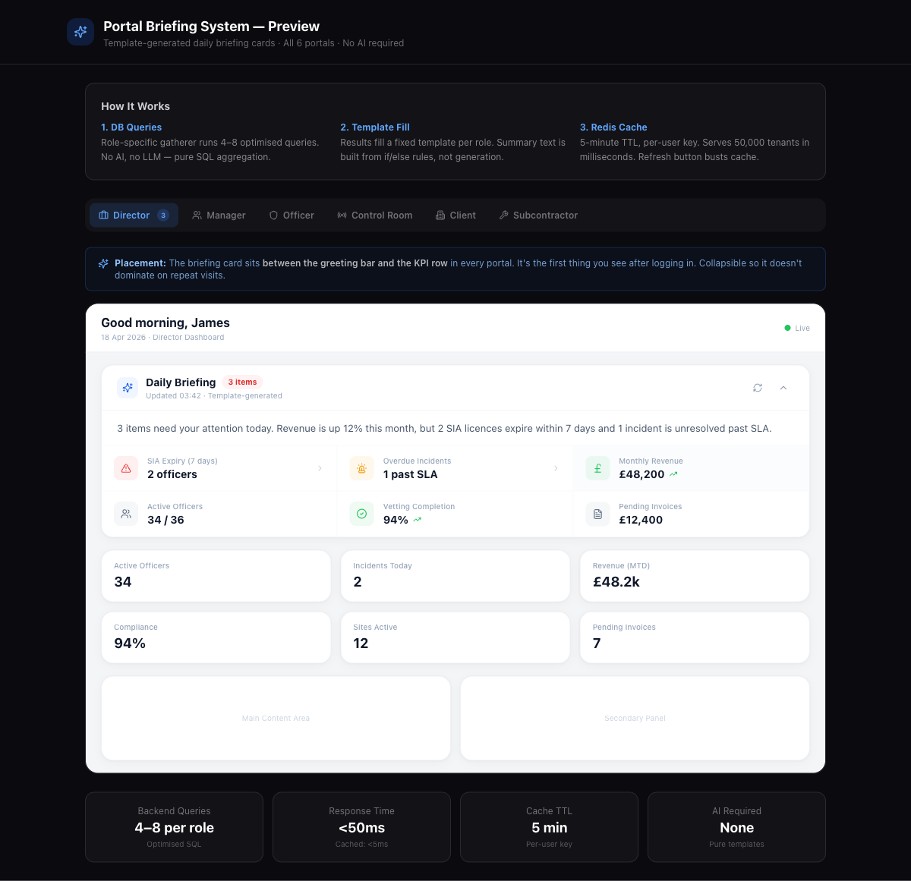
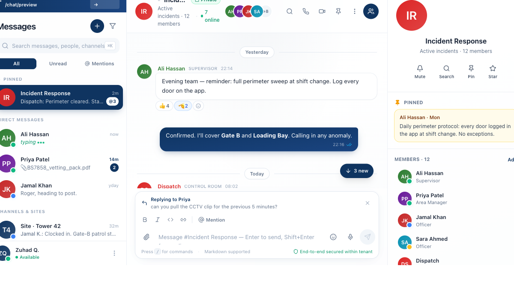
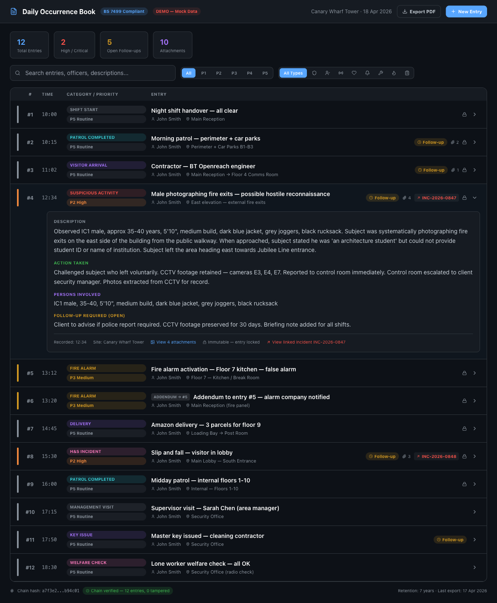
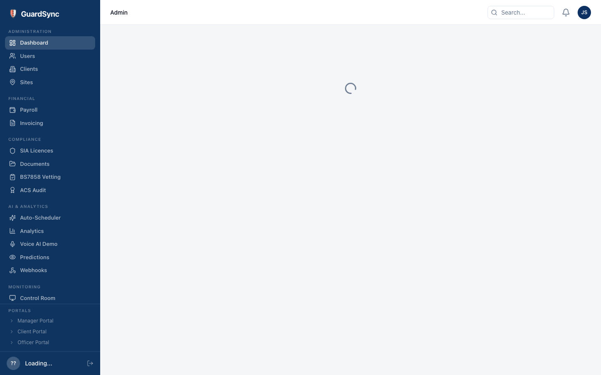
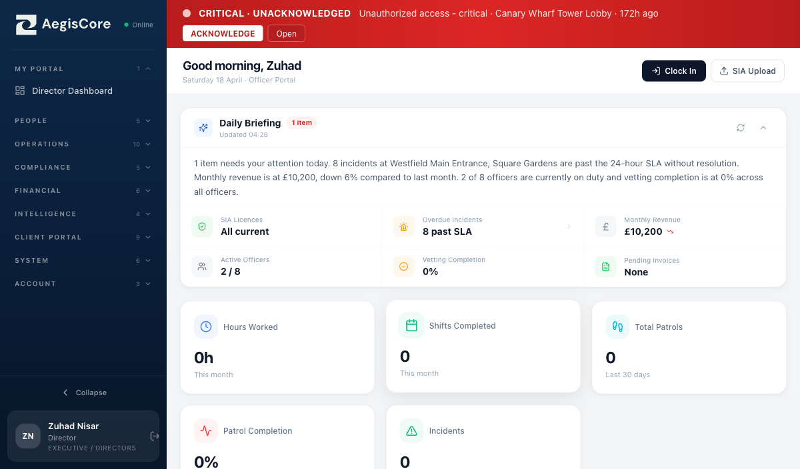

<p align="center">
  
</p>

<h3 align="center">Security Operations Management Platform</h3>

<p align="center">
  Multi-tenant SaaS for security guard companies — real-time monitoring, officer management, compliance tracking & encrypted communications.
</p>

<p align="center">
  
  
  
  
  
</p>

> **This is a demo repository.** It showcases the architecture, features, and UI of AegisCore. The full source code is in a private repository.

---

## The Problem

UK security companies lose thousands monthly to:
- **Disputed invoices** — no proof officers were on-site
- **Compliance gaps** — expired SIA licences discovered during audits
- **Communication chaos** — WhatsApp groups instead of secure, auditable channels
- **Manual scheduling** — Excel rosters that don't account for compliance or availability

## The Solution

AegisCore replaces fragmented tools with one platform that covers the entire security operations workflow.

---

## Screenshots

### Login — Role-Based Access
Dual login: Email for directors/managers, Phone OTP for officers in the field.

<p align="center">
  
</p>

### Control Room — Live Monitoring
Real-time map with officer positions, active alerts, patrol status, and CCTV feeds. The nerve center for 24/7 operations.

<p align="center">
  
</p>

### Director Dashboard — Daily Briefing
Auto-generated daily briefing with KPIs: SIA licence expiry warnings, overdue incidents, revenue tracking, compliance scores.

<p align="center">
  
</p>

### Encrypted Chat — Slack-Style Comms
End-to-end encrypted messaging with channels per site, incident threads, file sharing, and full audit trail.

<p align="center">
  
</p>

### Daily Occurrence Book (DOB)
Digital logbook replacing paper DOBs — timestamped entries, severity levels, handover notes, and search across all sites.

<p align="center">
  
</p>

### Admin Panel — Full Platform Management
Users, clients, sites, payroll, invoicing, SIA licences, documents, vetting, scheduling, and more — all in one sidebar.

<p align="center">
  
</p>

### Officer Portal — Field Operations
Officers see their briefing, clock in/out with geofencing, upload SIA documents, and manage their shifts from any device.

<p align="center">
  
</p>

---

## Architecture

```
┌─────────────────────────────────────────────────────────────┐
│                    CLIENTS (Browser / Mobile)                │
│   Next.js 14 Web App          React Native Mobile App       │
└───────────────────────────────┬─────────────────────────────┘
                                │
                    ┌───────────▼───────────┐
                    │   Django REST API      │
                    │   43 models · 18 apps  │
                    │   JWT + OTP Auth       │
                    └───┬───────┬───────┬───┘
                        │       │       │
              ┌─────────▼─┐ ┌──▼──┐ ┌──▼──────┐
              │ PostgreSQL │ │Redis│ │RabbitMQ  │
              │    16      │ │Cache│ │ + Celery │
              └────────────┘ └─────┘ └─────────┘
                        │       │
              ┌─────────▼─┐ ┌──▼──────┐
              │   MinIO    │ │ Soketi  │
              │  (S3 Files)│ │WebSocket│
              └────────────┘ └─────────┘
```

## 18 Modules

| # | Module | Description |
|---|--------|-------------|
| 1 | **Auth** | JWT + Phone OTP login, onboarding flow |
| 2 | **Users** | Multi-tenant user management, role-based permissions |
| 3 | **Clients** | Client company CRUD |
| 4 | **Sites** | Site management with geofencing |
| 5 | **Shifts** | Template-based scheduling, roster generation |
| 6 | **Timesheets** | GPS-verified clock in/out, manager approval |
| 7 | **Leave** | Leave requests and approvals |
| 8 | **Patrols** | Route management, checkpoint scanning, proof chains |
| 9 | **Incidents** | Incident reporting with severity, comments, resolution |
| 10 | **Alerts & DOB** | Real-time alerts, dispatch, digital occurrence book |
| 11 | **Financial** | Pay rates, automated invoicing, pay runs |
| 12 | **Compliance** | SIA licence tracking, BS7858 vetting, document management |
| 13 | **Monitoring** | CCTV integration (RTSP/HLS), GPS tracking, control room |
| 14 | **Messaging** | Encrypted chat channels with audit trail |
| 15 | **Notifications** | In-app + email alerts |
| 16 | **Analytics** | KPI dashboards, AI-powered scheduling & anomaly detection |
| 17 | **Webhooks** | External integrations, full audit logging |
| 18 | **Client Portal** | Client-facing dashboard for their sites and reports |

## Tech Stack

| Layer | Technology |
|-------|-----------|
| **Backend** | Django 5.1, Django REST Framework, Celery |
| **Frontend** | Next.js 14, Tailwind CSS, shadcn/ui, React Query |
| **Mobile** | React Native / Expo |
| **Database** | PostgreSQL 16 |
| **Cache** | Redis |
| **Queue** | RabbitMQ |
| **File Storage** | MinIO (S3-compatible) |
| **Real-time** | Soketi (Pusher-compatible WebSockets) |
| **CCTV** | MediaMTX (RTSP/HLS relay) |
| **AI** | Custom algorithms + Ollama |
| **API Docs** | drf-spectacular (Swagger/OpenAPI) |
| **Deployment** | Docker + Coolify |

## 6 Role-Based Portals

| Portal | Users | Access |
|--------|-------|--------|
| **Director** | Company owners | Full platform + financial reports + AI insights |
| **Manager** | Area/site managers | Sites, officers, timesheets, incidents |
| **Officer** | Security guards | Clock in/out, patrols, DOB entries, chat |
| **Control Room** | Operators | Live map, alerts, dispatch, CCTV |
| **Client** | End-customers | Their sites, reports, invoices |
| **Subcontractor** | Partner companies | Assigned shifts, compliance docs |

---

## Contact

**Zuhad Nisar** — Full-Stack & Mobile App Developer (AI Enhanced)

[](mailto:Zuhadnisar@gmail.com)
[](https://github.com/Zuhad-Nisar)
